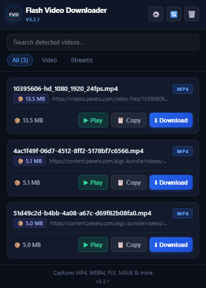
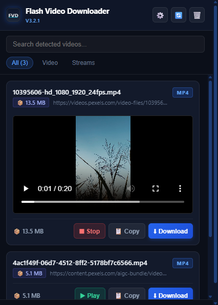
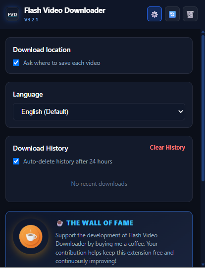

# Flash Video Downloader

<p align="center">
  
</p>

<p align="center">
  <strong>Detect and save openly accessible videos from the page you are viewing.</strong><br/>
  Manifest V3 · Free to install · Optional Pro via Ko-fi · Created by nRn World
</p>

<p align="center">
  <a href="https://chromewebstore.google.com/detail/blbajmihakahbldejkginpccillhakdg"></a>
  <a href="https://github.com/nRn-World/FlashVideoDownloader"></a>
  <a href="https://developer.chrome.com/docs/extensions/mv3/"></a>
  <a href="LICENSE"></a>
  <a href="https://ko-fi.com/s/72a48b875e"></a>
</p>

---

## Overview

**Flash Video Downloader** helps you save videos you are already watching on supported websites. It combines network sniffing with on-page video detection, so you get a clean list of downloadable media instead of dozens of unrelated segment URLs.

The extension focuses on **visible page videos**, offers **pause / resume / cancel** during downloads, lets you choose **where files are saved**, and ships with **6 languages**.

### Free vs Pro

| | Free | Pro |
|---|---|---|
| Detect, preview, pause / resume / cancel | Yes | Yes |
| Downloads per hour | **1** | Unlimited |
| Concurrent downloads | 1 | 3 |
| Download history | Last 10 | Unlimited |
| Price | Free | **EUR 10.99** one-time, lifetime |

Buy Pro on [Ko-fi](https://ko-fi.com/s/72a48b875e). After payment, copy the license key from the thank-you page. Open the extension → **Settings** → **Pro** → paste key → **Activate**.

> **Important:** This extension does not bypass DRM. Sites such as YouTube, Netflix, Twitch, Disney+, and Spotify are blocked by design for Chrome Web Store compliance.

---

## Screenshots

<p align="center">
  
</p>

<p align="center">
  <em>Detect videos on the page, preview them, and download with one click.</em>
</p>

<table align="center">
  <tr>
    <td align="center" width="50%">
      <br/>
      <sub>Live progress with pause, resume, and cancel</sub>
    </td>
    <td align="center" width="50%">
      <br/>
      <sub>Settings, history, folder picker, and Pro upgrade</sub>
    </td>
  </tr>
</table>

---

## Features

| Category | Details |
|---|---|
| **Detection** | Network sniffing + visible `<video>` scanning on the active tab |
| **Formats** | MP4, WEBM, FLV, MKV, MOV, AVI, M3U8, MPD, TS, MP3, and more |
| **HLS / streams** | Offscreen pipeline merges segments into a playable file (TS → MP4 remux via mux.js) |
| **Download control** | Pause, resume, cancel, and global active-download banner |
| **Save location** | Ask each time, or save all videos to a folder you pick on your computer |
| **Languages** | English, Svenska, Türkçe, Español, Français, العربية |
| **History** | Last 10 (Free) or unlimited (Pro), optional 24-hour auto-cleanup |
| **Rate limits** | Free: 1 download per rolling hour, 1 concurrent. Pro: unlimited hourly, 3 concurrent |
| **Pro** | Optional EUR 10.99 lifetime license via [Ko-fi](https://ko-fi.com/s/72a48b875e) |
| **Privacy** | On-demand content script injection · no analytics · blocked-host list |

---

## Download

**[⬇ Add Flash Video Downloader from the Chrome Web Store](https://chromewebstore.google.com/detail/blbajmihakahbldejkginpccillhakdg)**

1. Open the store listing
2. Click **Add to Chrome**
3. Pin **Flash Video Downloader** to your toolbar

---

## Installation from source

```bash
git clone https://github.com/nRn-World/FlashVideoDownloader.git
cd FlashVideoDownloader
```

1. Open `chrome://extensions/`
2. Enable **Developer mode**
3. Click **Load unpacked**
4. Select the project folder
5. Pin **Flash Video Downloader** to your toolbar

Do not test on `chrome://` pages (including `chrome://extensions`). Open a normal website, play a video, then open the popup.

### Update a local install

```bash
git pull origin main
```

Then click **Reload** on the extension card in `chrome://extensions/`.

---

## How to use

1. Open a supported website and **play the video** you want to save.
2. Click the extension icon.
3. Press **Refresh** if the video does not appear immediately.
4. Click **Download**.
5. Use **Pause**, **Resume**, or **Cancel** from **Active Downloads**.
6. Open **Settings** for language, download folder, history, and Pro.

### Activate Pro

1. Buy a license: [ko-fi.com/s/72a48b875e](https://ko-fi.com/s/72a48b875e) (EUR 10.99, lifetime).
2. Copy the key from the Ko-fi thank-you page.
3. Extension → Settings → Pro → paste key → Activate.

### Download location

- **Default:** Chrome asks where to save each video.
- **Fixed folder:** Disable “Ask where to save each video” and choose a folder. Later downloads go there automatically.

---

## Supported formats

<details>
<summary><strong>View full format list</strong></summary>

`mp4`, `m4v`, `m4s`, `fmp4`, `webm`, `flv`, `f4v`, `m3u8`, `m3u`, `mpd`, `ts`, `m2ts`, `mts`, `mov`, `avi`, `mkv`, `ogv`, `3gp`, `3g2`, `wmv`, `mp3`, `m4a`, `aac`, `wav`, `ogg`, `opus`, `flac`, plus `blob:` sources from in-page players.

</details>

---

## Project structure

| File | Purpose |
|---|---|
| `manifest.json` | MV3 manifest, permissions, CSP, locales |
| `background.js` | Network sniffing, download state, offscreen orchestration, rate limits |
| `offscreen.js` | HLS/generic download engine, blob merge, file delivery |
| `content.js` | Visible video DOM scan (on-demand injection) |
| `popup.js` / `.html` / `.css` | UI, settings, history, progress, Pro upgrade |
| `license.js` | Pro license check and Free hourly limit |
| `blocked-hosts.js` | DRM / policy-restricted platform blocklist |
| `storage-handles.js` | File System Access directory handle persistence |
| `i18n.js` | In-extension translations |
| `privacy.html` | Privacy policy ([live](https://nrn-world.github.io/FlashVideoDownloader/privacy.html)) |
| `pages/pro.html` | Pro landing page on GitHub Pages |
| `workers/fvd-rate-limit.js` | Optional Cloudflare Worker to keep the Free limit after reinstall |

---

## Building a release ZIP

```bat
create_zip.bat
```

See `STORE_LISTING.md` for Chrome Web Store listing text and the privacy-policy URL.

---

## Support the project

- **Pro license (EUR 10.99 lifetime):** [ko-fi.com/s/72a48b875e](https://ko-fi.com/s/72a48b875e)
- **Tip / coffee:** [ko-fi.com/nrnworld](https://ko-fi.com/nrnworld)

---

## License

This project is licensed under the **Creative Commons Attribution-NonCommercial 4.0 International License (CC BY-NC 4.0)**.

- You may share and adapt the material for **non-commercial** use.
- You must give **appropriate credit** and link to the license.
- See [`LICENSE`](LICENSE) for the full text.

---

## Contact

**nRn World**  
Email: [bynrnworld@gmail.com](mailto:bynrnworld@gmail.com)  
GitHub: [nRn-World/FlashVideoDownloader](https://github.com/nRn-World/FlashVideoDownloader)  
Chrome Web Store: [Flash Video Downloader](https://chromewebstore.google.com/detail/blbajmihakahbldejkginpccillhakdg)  
Privacy policy: [nrn-world.github.io/FlashVideoDownloader/privacy.html](https://nrn-world.github.io/FlashVideoDownloader/privacy.html)

---

## Changelog

| Version | Highlights |
|---|---|
| **3.3.2** | Fix service-worker message handling that showed as an error in `chrome://extensions` |
| **3.3.1** | Freemium: Free 1 download/hour; Pro lifetime via Ko-fi (EUR 10.99) |
| **3.3.0** | First Pro/Free split (later priced at EUR 10.99 on Ko-fi) |
| **3.2.5** | Better detection for tube/CMS URLs (`.mp4/`, `/get_file/`), iframe scan, less aggressive preview filter |
| **3.2.4** | Stronger HLS/DASH downloads: page Referer retries, lower parallelism, segment repair, MPD support |
| **3.2.3** | Fix post-download crash (`chrome.storage`), save HLS/blob via offscreen `chrome.downloads` |
| **3.2.2** | Direct `chrome.downloads` for MP4/WEBM, safer defaults for store review, blob via content script |
| **3.2.1** | Chrome Web Store readiness, DRM blocklist, visible-video filtering, folder picker, CC BY-NC license |
| **3.2.0** | Pause/resume/cancel, smooth progress, universal download pipeline, blob support |
| **3.1.0** | Offscreen HLS engine, global active-downloads banner |
| **3.0.0** | i18n, download history, in-popup preview |

---

<p align="center">
  Created by ❤️ © nRn World
</p>
